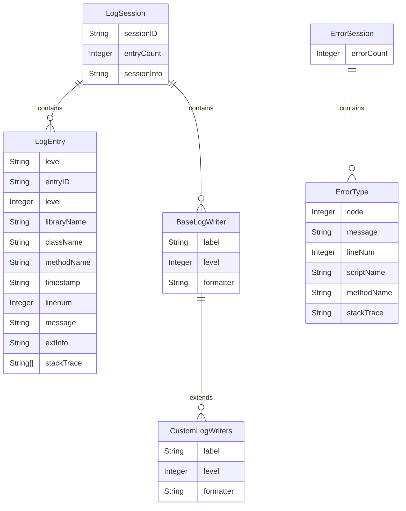
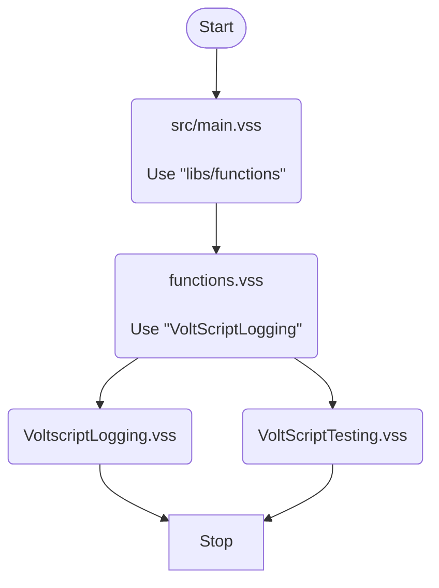
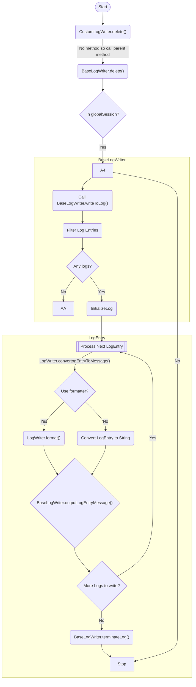
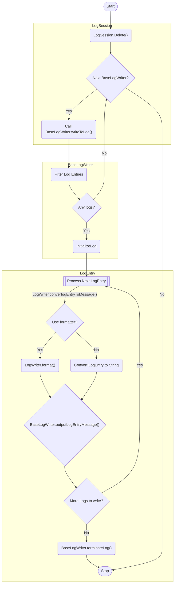

# How it works

There is only one LogSession, accessed via the global variable `globalLogSession`. The code is deliberately designed to force this as a singleton, created during the `Initialize`.

There is only one ErrorSession, accessed via the global function `getErrorSession()`. The code is deliberately designed to force this as a singleton, lazy loaded on first usage. You may wish to just pass error information directly to a LogEntry.

## Structure

The structure is as below:

The LogSession contains zero to many LogEntries in a **List**. Each LogEntry corresponds to a single log message to be outputted.

The LogSession also contains zero to many LogWriters in a **List**. The LogWriter defines the minimum log level it should output, a format for what it should write, and a function to write each matching LogEntry.

The ErrorSession contains zero to many ErrorTypes in an **array**.

## Write log entries

For instances of BaseLogWriter, the `Delete` sub of the LogSession handles writing the log entries with the `writeToLog()` function. For instances of any derived class, the `Delete` sub of the BaseLogWriter handles writing the log entries out.

These functions handle identifying if it needs to log anything, initializing whatever location the logs will be written to, then writing each log, and doing any post-writing termination logic required, e.g. closing a file.

!!! warning
    If code subsequently decides a LogWriter should not write out content, **always** remove it from the globalLogSession.

!!! note
    Because there will be an increase in processing time for multiple LogWriters, it is best to minimize the number of LogWriters each piece of code needs to use or default to NO_LOGGING unless specifically switched on.

For different logging purposes, you should create a class extending `BaseLogWriter` and override the functions required:

--8<-- "logwriter.md"

The `writeLogEntry()` function handles how to write each log. It takes no arguments, so if there are objects required to write each log entry, e.g. a file to write to, these should be assigned to private variables in the class. It can call the `getFormattedString(LogEntry)` function to easily format a LogEntry to a string, replacing content in mustache template format with properties from the LogEntry. See the [Format log output](../howto/uselogwriter.md#formatters) how-to for clarification.

## Delete processes and writing logs

Classes variables are unloaded in reverse dependency-chain order. This means library modules are unloaded depending on their `Use` statement. First are "leaf" library modules that nothing else "uses", then "branch" library modules that only have `Use` statements pointing to already unloaded library modules. And finally "trunk" library modules that have no `Use` statements.

Example:

Classes and variables in main.vss will be unloaded first. They classes and variables in functions.vss will be unloaded. Then VoltScriptLogging.vss and VoltScriptTesting.vss. Any instance of classes from main.vss or functions.vss that have been passed to classes in VoltScriptLogging will be `Nothing` by the time the Delete process of classes in VoltScriptLogging run during its unload.

Of course if you extend `BaseLogWriter` class in functions.vss, `BaseLogWriter.Delete` method will get called from the extension when functions.vss is being unloaded **and** for `BaseLogWriter` itself when VoltScriptLogging.vss is unloaded.

So the delete process *needs* to have two different flows:

### Writing logs from custom LogWriters

As each instance of a custom LogWriter is unloaded, the `Delete` method will be called, and logs written out if appropriate.

### Writing logs from LogSession

By the time the LogSession is unloaded, only instances of BaseLogWriter will exist. All custom LogWriters will have been set to `Nothing`.

For more details on creating a custom LogWriter, see [Extend BaseLogWriter](../howto/logwriter.md).

## Extend BaseLogWriter

The BaseLogWriter just prints to the output, which will only be relevant when running locally. Specific LogWriters should be created for outputting to specific locations. When doing so override the following methods, as required:

--8<-- "logwriter.md"

## Filter logs

The LogWriter's `writeToLog()` function retrieves LogEntries based on the log level, using inclusive minimum and maximum levels. This can be used to get entries matching a specific log level, by using the same level for both minimum and maximum. Alternatively it can used to get all logs at or above a certain level, e.g. LOG_INFO or higher. Because LOG_FATAL corresponds to the integer 1, LOG_INFO or higher actually corresponds to LogEntries with a level of 8 or *lower*.

If you wish more sophisticated filtering, you can achieve this with extended classes or pattern matching.